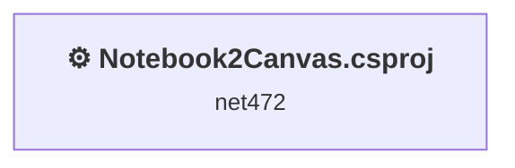
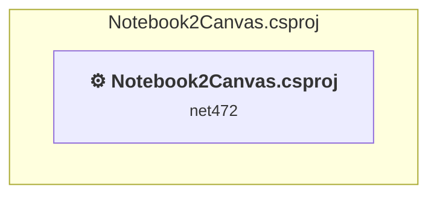

# Projects and dependencies analysis

This document provides a comprehensive overview of the projects and their dependencies in the context of upgrading to .NETCoreApp,Version=v10.0.

## Table of Contents

- [Executive Summary](#executive-Summary)
  - [Highlevel Metrics](#highlevel-metrics)
  - [Projects Compatibility](#projects-compatibility)
  - [Package Compatibility](#package-compatibility)
  - [API Compatibility](#api-compatibility)
  - [Binding Redirect Configuration](#binding-redirect-configuration)
- [Aggregate NuGet packages details](#aggregate-nuget-packages-details)
- [Top API Migration Challenges](#top-api-migration-challenges)
  - [Technologies and Features](#technologies-and-features)
  - [Most Frequent API Issues](#most-frequent-api-issues)
- [Projects Relationship Graph](#projects-relationship-graph)
- [Project Details](#project-details)

  - [Notebook2Canvas\Notebook2Canvas.csproj](#notebook2canvasnotebook2canvascsproj)

## Executive Summary

### Highlevel Metrics

| Metric | Count | Status |
| :--- | :---: | :--- |
| Total Projects | 1 | All require upgrade |
| Total NuGet Packages | 10 | 4 need upgrade |
| Total Code Files | 8 |  |
| Total Code Files with Incidents | 6 |  |
| Total Lines of Code | 948 |  |
| Total Number of Issues | 426 |  |
| Estimated LOC to modify | 415+ | at least 43.8% of codebase |

### Projects Compatibility

| Project | Target Framework | Difficulty | Package Issues | API Issues | Binding Issues | Est. LOC Impact | Description |
| :--- | :---: | :---: | :---: | :---: | :---: | :---: | :--- |
| [Notebook2Canvas\Notebook2Canvas.csproj](#notebook2canvasnotebook2canvascsproj) | net472 | 🟡 Medium | 9 | 415 | 0 | 415+ | ClassicWinForms, Sdk Style = False |

### Package Compatibility

| Status | Count | Percentage |
| :--- | :---: | :---: |
| ✅ Compatible | 6 | 60.0% |
| ⚠️ Incompatible | 0 | 0.0% |
| 🔄 Upgrade Recommended | 4 | 40.0% |
| ***Total NuGet Packages*** | ***10*** | ***100%*** |

### API Compatibility

| Category | Count | Impact |
| :--- | :---: | :--- |
| 🔴 Binary Incompatible | 366 | High - Require code changes |
| 🟡 Source Incompatible | 49 | Medium - Needs re-compilation and potential conflicting API error fixing |
| 🔵 Behavioral change | 0 | Low - Behavioral changes that may require testing at runtime |
| ✅ Compatible | 658 |  |
| ***Total APIs Analyzed*** | ***1073*** |  |

## Aggregate NuGet packages details

| Package | Current Version | Suggested Version | Projects | Description |
| :--- | :---: | :---: | :--- | :--- |
| Microsoft.Bcl.AsyncInterfaces | 10.0.2 | 10.0.12 | [Notebook2Canvas.csproj](#notebook2canvasnotebook2canvascsproj) | NuGet package upgrade is recommended |
| System.Buffers | 4.6.1 |  | [Notebook2Canvas.csproj](#notebook2canvasnotebook2canvascsproj) | NuGet package functionality is included with framework reference |
| System.IO.Pipelines | 10.0.2 | 10.0.12 | [Notebook2Canvas.csproj](#notebook2canvasnotebook2canvascsproj) | NuGet package upgrade is recommended |
| System.Memory | 4.6.3 |  | [Notebook2Canvas.csproj](#notebook2canvasnotebook2canvascsproj) | NuGet package functionality is included with framework reference |
| System.Numerics.Vectors | 4.6.1 |  | [Notebook2Canvas.csproj](#notebook2canvasnotebook2canvascsproj) | NuGet package functionality is included with framework reference |
| System.Runtime.CompilerServices.Unsafe | 6.1.2 |  | [Notebook2Canvas.csproj](#notebook2canvasnotebook2canvascsproj) | ✅Compatible |
| System.Text.Encodings.Web | 10.0.2 | 10.0.12 | [Notebook2Canvas.csproj](#notebook2canvasnotebook2canvascsproj) | NuGet package upgrade is recommended |
| System.Text.Json | 10.0.2 | 10.0.12 | [Notebook2Canvas.csproj](#notebook2canvasnotebook2canvascsproj) | NuGet package upgrade is recommended |
| System.Threading.Tasks.Extensions | 4.6.3 |  | [Notebook2Canvas.csproj](#notebook2canvasnotebook2canvascsproj) | NuGet package functionality is included with framework reference |
| System.ValueTuple | 4.6.1 |  | [Notebook2Canvas.csproj](#notebook2canvasnotebook2canvascsproj) | NuGet package functionality is included with framework reference |

## Top API Migration Challenges

### Technologies and Features

| Technology | Issues | Percentage | Migration Path |
| :--- | :---: | :---: | :--- |
| Windows Forms | 366 | 88.2% | Windows Forms APIs for building Windows desktop applications with traditional Forms-based UI that are available in .NET on Windows. Enable Windows Desktop support: Option 1 (Recommended): Target net9.0-windows; Option 2: Add <UseWindowsDesktop>true</UseWindowsDesktop>; Option 3 (Legacy): Use Microsoft.NET.Sdk.WindowsDesktop SDK. |
| GDI+ / System.Drawing | 47 | 11.3% | System.Drawing APIs for 2D graphics, imaging, and printing that are available via NuGet package System.Drawing.Common. Note: Not recommended for server scenarios due to Windows dependencies; consider cross-platform alternatives like SkiaSharp or ImageSharp for new code. |
| Legacy Configuration System | 2 | 0.5% | Legacy XML-based configuration system (app.config/web.config) that has been replaced by a more flexible configuration model in .NET Core. The old system was rigid and XML-based. Migrate to Microsoft.Extensions.Configuration with JSON/environment variables; use System.Configuration.ConfigurationManager NuGet package as interim bridge if needed. |

### Most Frequent API Issues

| API | Count | Percentage | Category |
| :--- | :---: | :---: | :--- |
| T:System.Windows.Forms.Label | 42 | 10.1% | Binary Incompatible |
| T:System.Windows.Forms.RichTextBox | 21 | 5.1% | Binary Incompatible |
| T:System.Windows.Forms.TextBox | 18 | 4.3% | Binary Incompatible |
| P:System.Windows.Forms.Control.Size | 15 | 3.6% | Binary Incompatible |
| T:System.Windows.Forms.FlatStyle | 15 | 3.6% | Binary Incompatible |
| P:System.Windows.Forms.Control.Name | 14 | 3.4% | Binary Incompatible |
| T:System.Windows.Forms.Control.ControlCollection | 13 | 3.1% | Binary Incompatible |
| P:System.Windows.Forms.Control.Controls | 13 | 3.1% | Binary Incompatible |
| M:System.Windows.Forms.Control.ControlCollection.Add(System.Windows.Forms.Control) | 13 | 3.1% | Binary Incompatible |
| P:System.Windows.Forms.Control.TabIndex | 13 | 3.1% | Binary Incompatible |
| P:System.Windows.Forms.Control.Location | 13 | 3.1% | Binary Incompatible |
| T:System.Windows.Forms.Button | 12 | 2.9% | Binary Incompatible |
| T:System.Windows.Forms.ComboBox | 10 | 2.4% | Binary Incompatible |
| P:System.Windows.Forms.Control.ForeColor | 7 | 1.7% | Binary Incompatible |
| P:System.Windows.Forms.ButtonBase.BackColor | 7 | 1.7% | Binary Incompatible |
| T:System.Drawing.Drawing2D.SmoothingMode | 6 | 1.4% | Source Incompatible |
| E:System.Windows.Forms.Control.Click | 6 | 1.4% | Binary Incompatible |
| T:System.Drawing.Graphics | 5 | 1.2% | Source Incompatible |
| P:System.Windows.Forms.PaintEventArgs.Graphics | 5 | 1.2% | Binary Incompatible |
| T:System.Windows.Forms.FlatButtonAppearance | 5 | 1.2% | Binary Incompatible |
| P:System.Windows.Forms.ButtonBase.FlatAppearance | 5 | 1.2% | Binary Incompatible |
| P:System.Windows.Forms.FlatButtonAppearance.BorderSize | 5 | 1.2% | Binary Incompatible |
| F:System.Windows.Forms.FlatStyle.Flat | 5 | 1.2% | Binary Incompatible |
| P:System.Windows.Forms.ButtonBase.FlatStyle | 5 | 1.2% | Binary Incompatible |
| P:System.Windows.Forms.RichTextBox.Text | 5 | 1.2% | Binary Incompatible |
| M:System.Windows.Forms.Control.Invalidate | 4 | 1.0% | Binary Incompatible |
| T:System.Drawing.Region | 4 | 1.0% | Source Incompatible |
| T:System.Drawing.Drawing2D.GraphicsPath | 4 | 1.0% | Source Incompatible |
| M:System.Drawing.Drawing2D.GraphicsPath.AddArc(System.Single,System.Single,System.Single,System.Single,System.Single,System.Single) | 4 | 1.0% | Source Incompatible |
| T:System.Windows.Forms.DialogResult | 4 | 1.0% | Binary Incompatible |
| T:System.Windows.Forms.Application | 4 | 1.0% | Binary Incompatible |
| P:System.Windows.Forms.ButtonBase.UseVisualStyleBackColor | 4 | 1.0% | Binary Incompatible |
| P:System.Windows.Forms.ButtonBase.Text | 4 | 1.0% | Binary Incompatible |
| P:System.Windows.Forms.Label.Text | 4 | 1.0% | Binary Incompatible |
| P:System.Windows.Forms.Label.AutoSize | 4 | 1.0% | Binary Incompatible |
| M:System.Windows.Forms.Label.#ctor | 4 | 1.0% | Binary Incompatible |
| P:System.Windows.Forms.Control.Height | 3 | 0.7% | Binary Incompatible |
| T:System.Drawing.Drawing2D.PenAlignment | 3 | 0.7% | Source Incompatible |
| T:System.Drawing.Pen | 3 | 0.7% | Source Incompatible |
| M:System.Drawing.Pen.#ctor(System.Drawing.Color,System.Single) | 3 | 0.7% | Source Incompatible |
| M:System.Windows.Forms.Button.#ctor | 3 | 0.7% | Binary Incompatible |
| T:System.Windows.Forms.AutoScaleMode | 3 | 0.7% | Binary Incompatible |
| T:System.Windows.Forms.Control | 2 | 0.5% | Binary Incompatible |
| P:System.Windows.Forms.Control.Parent | 2 | 0.5% | Binary Incompatible |
| P:System.Windows.Forms.Control.Region | 2 | 0.5% | Binary Incompatible |
| P:System.Drawing.Graphics.SmoothingMode | 2 | 0.5% | Source Incompatible |
| M:System.Drawing.Graphics.DrawPath(System.Drawing.Pen,System.Drawing.Drawing2D.GraphicsPath) | 2 | 0.5% | Source Incompatible |
| E:System.Windows.Forms.Control.Resize | 2 | 0.5% | Binary Incompatible |
| T:System.Windows.Forms.MessageBoxIcon | 2 | 0.5% | Binary Incompatible |
| T:System.Windows.Forms.MessageBoxButtons | 2 | 0.5% | Binary Incompatible |

## Projects Relationship Graph

Legend:
📦 SDK-style project
⚙️ Classic project

## Project Details

### Notebook2Canvas\Notebook2Canvas.csproj

#### Project Info

- **Current Target Framework:** net472
- **Proposed Target Framework:** net10.0-windows
- **SDK-style**: False
- **Project Kind:** ClassicWinForms
- **Dependencies**: 0
- **Dependants**: 0
- **Number of Files**: 10
- **Number of Files with Incidents**: 6
- **Lines of Code**: 948
- **Estimated LOC to modify**: 415+ (at least 43.8% of the project)

#### Dependency Graph

Legend:
📦 SDK-style project
⚙️ Classic project

### API Compatibility

| Category | Count | Impact |
| :--- | :---: | :--- |
| 🔴 Binary Incompatible | 366 | High - Require code changes |
| 🟡 Source Incompatible | 49 | Medium - Needs re-compilation and potential conflicting API error fixing |
| 🔵 Behavioral change | 0 | Low - Behavioral changes that may require testing at runtime |
| ✅ Compatible | 658 |  |
| ***Total APIs Analyzed*** | ***1073*** |  |

#### Project Technologies and Features

| Technology | Issues | Percentage | Migration Path |
| :--- | :---: | :---: | :--- |
| Legacy Configuration System | 2 | 0.5% | Legacy XML-based configuration system (app.config/web.config) that has been replaced by a more flexible configuration model in .NET Core. The old system was rigid and XML-based. Migrate to Microsoft.Extensions.Configuration with JSON/environment variables; use System.Configuration.ConfigurationManager NuGet package as interim bridge if needed. |
| GDI+ / System.Drawing | 47 | 11.3% | System.Drawing APIs for 2D graphics, imaging, and printing that are available via NuGet package System.Drawing.Common. Note: Not recommended for server scenarios due to Windows dependencies; consider cross-platform alternatives like SkiaSharp or ImageSharp for new code. |
| Windows Forms | 366 | 88.2% | Windows Forms APIs for building Windows desktop applications with traditional Forms-based UI that are available in .NET on Windows. Enable Windows Desktop support: Option 1 (Recommended): Target net9.0-windows; Option 2: Add <UseWindowsDesktop>true</UseWindowsDesktop>; Option 3 (Legacy): Use Microsoft.NET.Sdk.WindowsDesktop SDK. |

